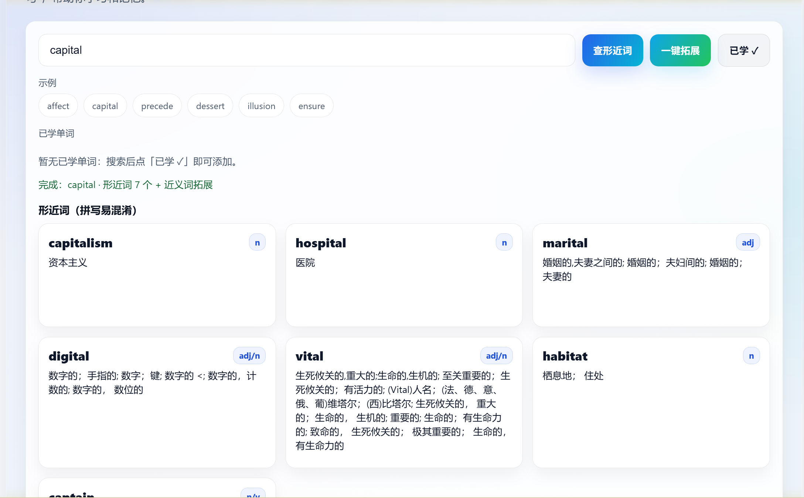
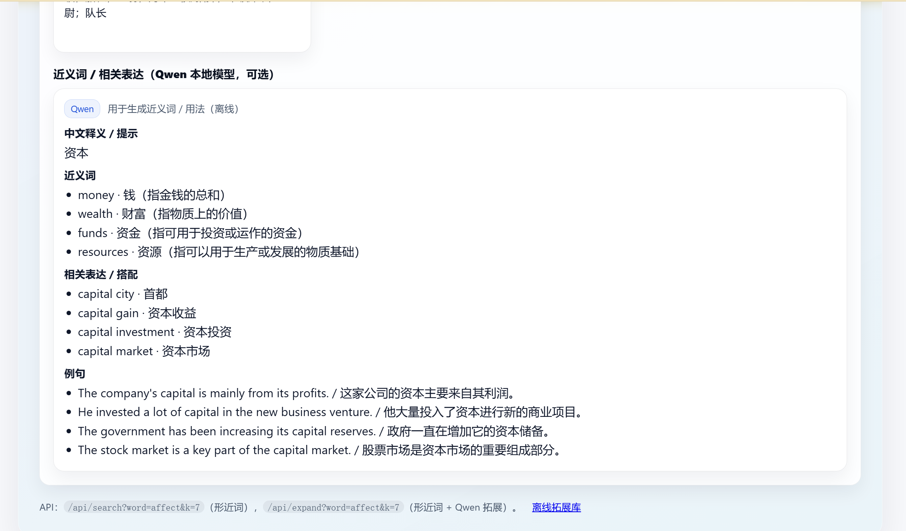

# FuzzyWord

<p align="center">
  
  
</p>

一个可离线运行的英语单词学习工具：
- **形近词（易混淆拼写）**：本地算法快速检索 + 给出编辑路径/混淆线索
- **近义词/搭配/例句拓展（可选）**：本地 Qwen3-1.7B 生成，并支持离线缓存秒查

> 适合：学完一个单词后，快速扩展形近词 + 近义词 + 用法内容，做复习与记忆。

## 目录结构
- `server.js`：Node.js 服务（无 npm 依赖），提供 API + 静态页面
- `public/`：前端页面（中文 + 亮色）
  - `public/index.html`：主界面（形近词 + 一键拓展）
  - `public/library.html`：离线拓展库入口（只读缓存）
- `data/merged_dictionary.json`：本地词典（默认读取）
- `data/qwen_cache.jsonl`：离线拓展缓存（运行预计算后生成，**不要提交到 GitHub**）
- `tools/qwen_worker.py`：本地模型推理 worker（Python）
- `tools/precompute_qwen_cache.js`：批量预计算并写入 `data/qwen_cache.jsonl`
- `tools/download_qwen_model.py`：下载模型到项目内 `models/`
- `models/`：模型目录（**不要提交到 GitHub**）
- `.hf/`：Hugging Face 缓存目录（**不要提交到 GitHub**）

## 快速开始（仅形近词）
前置：安装 Node.js（建议 16+）。

```powershell
node .\server.js
```
浏览器打开：`http://localhost:3000`

## 启用 Qwen（可选：近义词/拓展）
### 1) 安装 Python 依赖
前置：Python 3.10+。

```powershell
python -m pip install -U -r requirements.txt
```

`torch` 与硬件/驱动强相关，请按 PyTorch 官方指引安装（CPU 或 CUDA）。

### 2) 模型目录（项目内）
默认模型会放到项目目录：`models/Qwen3-1.7B`

你也可以用环境变量覆盖（支持相对路径）：
- `QWEN_MODEL_PATH`（默认 `models/Qwen3-1.7B`）
- `HF_HOME`（默认 `.hf`，用于把 HF 缓存也放在项目内）

### 3) 自动下载模型
当模型不存在时，预计算脚本和服务端（实时调用模式）会自动尝试下载到 `models/Qwen3-1.7B`。

如果你不想自动下载：
- 设置 `QWEN_AUTO_DOWNLOAD=0`

如果你需要鉴权下载：
- 设置 `HF_TOKEN`（Hugging Face Access Token）

## 离线预计算（推荐：一次生成，后续秒查）
预计算会把每个单词的近义词/搭配/例句等拓展保存为 JSONL：`data/qwen_cache.jsonl`。

```powershell
node .\tools\precompute_qwen_cache.js --dict .\data\merged_dictionary.json --out .\data\qwen_cache.jsonl
```

先跑一小部分（例如 200 个）：
```powershell
$env:LIMIT=200
node .\tools\precompute_qwen_cache.js
```

## 离线拓展库入口（只读缓存）
启动服务后打开：
- `http://localhost:3000/library.html`

## 配置项（环境变量）
- `PORT`：服务端口（默认 3000）
- `DICT_PATH`：词典路径（默认 `data/merged_dictionary.json`，支持相对路径）
- `QWEN_CACHE_PATH`：离线缓存（默认 `data/qwen_cache.jsonl`，支持相对路径）
- `QWEN_PYTHON`：Python 可执行文件（默认 `python`）
- `QWEN_MODEL_PATH`：模型目录（默认 `models/Qwen3-1.7B`，支持相对路径）
- `QWEN_LIVE`：未命中缓存时是否允许实时调用模型（默认关闭；`1/true` 开启）
- `QWEN_AUTO_DOWNLOAD`：模型不存在时是否自动下载（默认开启；`0/false` 关闭）

## 开源发布建议（GitHub）
建议不要提交以下文件/目录（已在 `.gitignore` 中列出）：
- `models/`（模型权重）
- `.hf/`（HF 缓存）
- `data/qwen_cache.jsonl`（预计算结果）

另外：请确保你使用/分发的词典数据 `data/merged_dictionary.json` 具备相应授权。

## License
MIT（见 `LICENSE`）。
